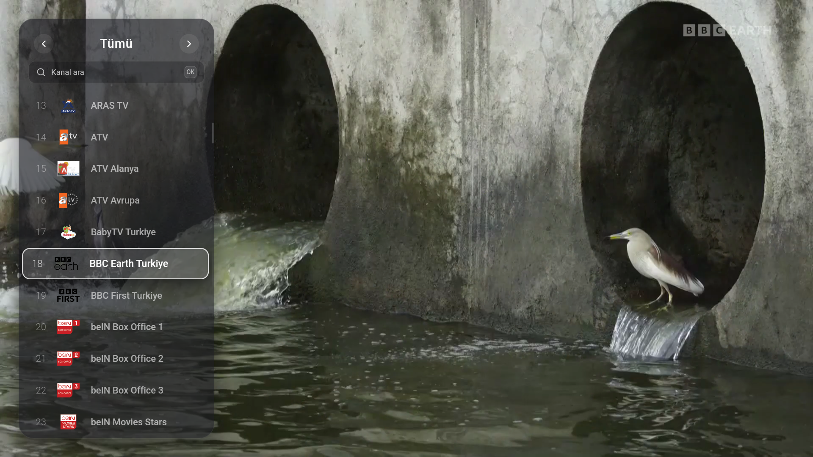
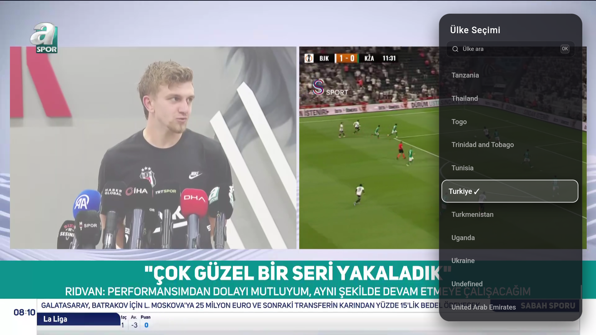
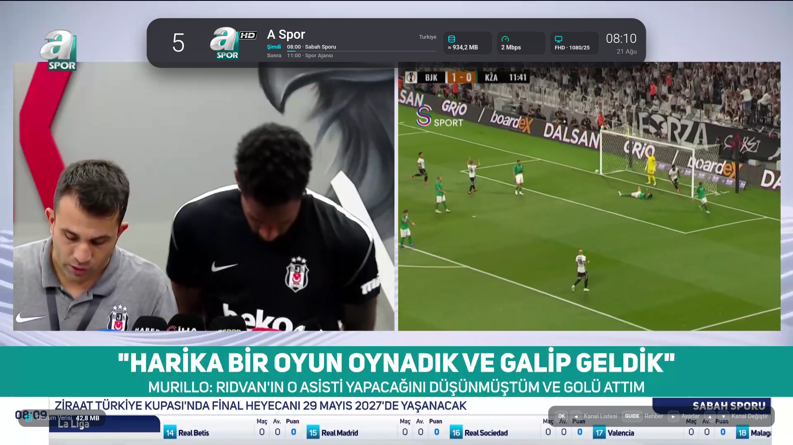

<p align="center">
  
</p>

<h1 align="center">Seyirva</h1>

<p align="center">
  Google TV · Android TV · Tablet · Telefon için ücretsiz canlı yayın uygulaması
</p>

<p align="center">
  <a href="https://github.com/livvaa/seyirva-releases/releases/latest">
    
  </a>
</p>

---

## Nedir?

**Seyirva**, Google TV, Android TV kutuları, tablet ve telefonlarda çalışan bir canlı TV ve kamera yayın uygulamasıdır. Hiçbir video veya yayın barındırmaz; yalnızca [iptv-org](https://github.com/iptv-org/iptv) tarafından toplanan kamuya açık yayın bağlantılarını oynatır.

Tek bir APK tüm cihazlarda çalışır — televizyonda kumandayla, tablet ve telefonda dokunmatik kontrollerle.

## Öne Çıkan Özellikler

| Özellik | Açıklama |
|---|---|
| 📺 **200+ ülke** | Dünyanın dört bir yanından canlı TV kanalları |
| 📷 **Canlı kameralar** | 20 ülkeden trafik, sahil ve şehir kameraları |
| 📋 **Program rehberi (EPG)** | XMLTV tabanlı, şimdi ve sonraki program bilgisi |
| 🔍 **Kanal ve ülke arama** | TV kumandasıyla bile kullanılabilen sanal klavye |
| 🔄 **Otomatik sunucu geçişi** | Yayın kesilirse alternatif sunucuya otomatik geçiş |
| 🩺 **Sağlık taraması** | Çalışmayan kanallar arka planda tespit edilip listeden çıkar |
| 🏠 **Google TV entegrasyonu** | Ana ekranda "Şimdi Yayında" ve "İzlemeye devam et" kartları |
| 🌈 **Çevresel ışıklandırma** | Telefonda yayının rengi ekranın boş alanlarına yayılır |
| 🔄 **Otomatik güncelleme** | Yeni sürüm arka planda indirilir, açılışta kurulur |

## Ekran Görüntüleri

<p align="center">
  
  
</p>
<p align="center">
  
</p>

## Kurulum

### 1. APK'yı İndir

[**Releases**](https://github.com/livvaa/seyirva-releases/releases/latest) sayfasından en son `Seyirva-X.Y.Z.apk` dosyasını indirin.

### 2. Cihaza Yükle

#### Google TV / Android TV Kutusu
1. APK'yı bir USB belleğe kopyalayın veya **Send Files to TV** gibi bir uygulamayla cihaza gönderin.
2. Bir dosya yöneticisi ile APK'yı açın.
3. İlk seferde "Bilinmeyen uygulamalara izin ver" istenir — izni açın.
4. Kurulumu tamamlayın.

#### Tablet / Telefon
1. APK'yı doğrudan tarayıcıdan indirin.
2. Bildirim çubuğundan veya dosya yöneticisinden açın.
3. Gerekirse "Bilinmeyen kaynaklara izin ver" seçeneğini açın.
4. Kurulumu tamamlayın.

### 3. Kullanmaya Başla

İlk açılışta ülke seçimi yapın — uygulama o ülkedeki mevcut kanalları yükleyecek ve yayın başlayacak.

## Kumanda Kullanımı (TV)

| Tuş | İşlev |
|---|---|
| ◀ Sol | Kanal listesini aç |
| ▶ Sağ | Ayarları aç |
| ▲▼ Yukarı/Aşağı | Kanal değiştir |
| OK | Bilgi çubuğu / seç |
| Geri | Menüyü kapat / çık |
| 🔴 Kırmızı | Altyazı aç/kapat |
| 🟢 Yeşil | Ses kanalı değiştir |
| 🟡 Sarı | Program rehberi |
| 🔵 Mavi | Canlı yayına dön |

## Dokunmatik Kullanım (Tablet / Telefon)

| Hareket | İşlev |
|---|---|
| Sağa kaydır | Kanal listesini aç |
| Sola kaydır | Ayarları aç |
| Yukarı/Aşağı kaydır | Kanal değiştir |
| Dokun | Bilgi çubuğu |

## Güncelleme

Seyirva kendi kendini günceller:

1. Açılışta yeni sürüm olup olmadığını kontrol eder.
2. Varsa APK'yı arka planda sessizce indirir.
3. Sonraki açılışta kurulum ekranı gösterir.

Güncelleme zorunludur — yan yüklenen bir uygulamada atlanabilen güncelleme pratikte hiç kurulmuyor.

## Sorun Giderme

| Sorun | Çözüm |
|---|---|
| "Paket çakışması" hatası | Uygulamayı kaldırıp yeniden kurun (imza değişikliği) |
| Kanal açılmıyor | Başka bir kanala geçip tekrar deneyin; yayın kaynağı geçici olarak çökebilir |
| Güncelleme kurulamıyor | Ayarlar → Uygulamalar → Seyirva → "Bilinmeyen uygulamalara izin ver" |
| 1.1.1 kurulu ve güncelleme gelmiyor | 1.1.1 yanlış anahtarla imzalanmıştı ve geri çekildi. Uygulamayı kaldırıp Releases'teki en son sürümü kurun; sonraki güncellemeler yine kendiliğinden gelir |

## Yasal Uyarı

Seyirva hiçbir video veya yayın barındırmaz. Tüm yayınlar ve içerik hakları ilgili hak sahiplerine aittir. Uygulama yalnızca kamuya açık kaynaklardan toplanan bağlantıları oynatır.

---

<details>
<summary><strong>Geliştirici Notları</strong></summary>

### update.json

Bu depodaki `update.json`, uygulamanın açılışta okuduğu güncelleme bildirimidir:

| Alan | Anlamı |
|---|---|
| `versionCode` | Yüklü sürümden büyükse güncelleme indirilir |
| `versionName` | Kurulum ekranında gösterilir |
| `apkUrl` | APK'nın doğrudan HTTPS adresi |
| `sizeBytes` | İndirilen dosya bu boyutta değilse kurulum reddedilir |
| `notes` | Kurulum ekranında gösterilen değişiklik notu |
| `mandatory` | `true` ise açılışta kurulum ekranı zorunlu gelir |

### Yeni sürüm yayınlama

Elle yapmayın. Kaynak deposundaki (`livvaa/seyirva`) **Android APK** workflow'unu
`publish` seçeneğiyle çalıştırın: APK'yı üretir, imzasını doğrular, bu depoda release
açar ve `update.json`'u kendi ürettiği dosyadan yazar. Böylece dosya adı, boyut ve
sürüm birbirinden ayrılamaz.

### Bu depodaki workflow'lar

| Workflow | Ne yapar |
|---|---|
| **update.json doğrulama** | `update.json` her değiştiğinde ve her gün, manifest'in gösterdiği APK'yı indirir; adresi, boyutu ve imza sertifikasını kontrol eder |
| **Bozuk sürümü kaldır** | Elle çalıştırılır; verilen etiketin release'ini ve etiketini siler. `update.json` o sürümü gösteriyorsa reddeder |

### İmza — en kritik kural

Yayımlanan her APK **aynı** anahtarla imzalanmalıdır:

```
SHA-256  CE:1F:1D:F5:D0:91:6D:8F:04:9C:FD:62:0F:1C:21:61:
         D1:98:E8:92:66:98:0D:7D:53:E6:F4:B4:FC:1A:59:EA
```

İmza değişirse Android güncellemeyi "paket çakışması" diyerek reddeder ve kullanıcının
uygulamayı elle kaldırıp yeniden kurması gerekir. Uygulama bu durumu kendisi fark edip
açıklar, ama düzeltemez.

Sürüm 1.1.1 tam olarak bu yüzden geri çekildi: yayımlanan dosya `app-debug.apk` idi,
yani **debug anahtarıyla** imzalıydı (`CN=Android Debug`), üstelik `update.json` hiç var
olmayan bir `Seyirva-1.1.1.apk` adresini gösteriyordu. İkisi de artık workflow'lar
tarafından yakalanır.

</details>
